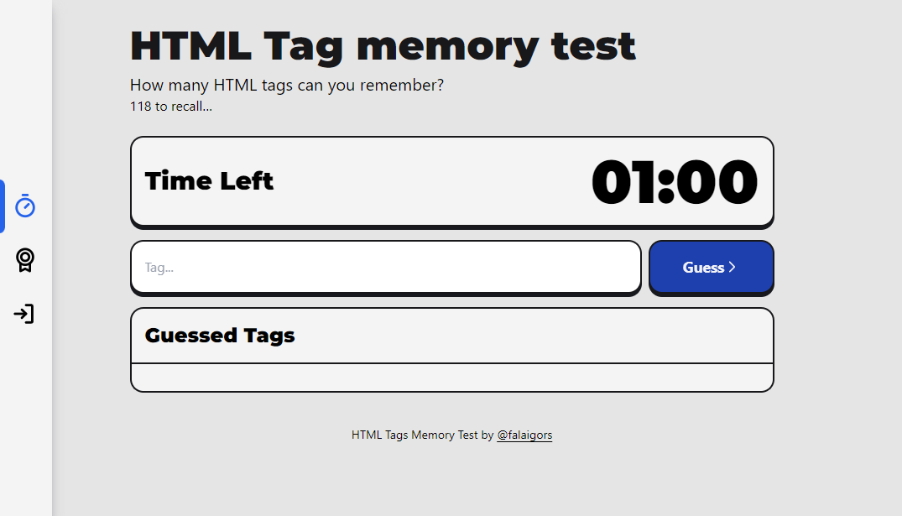

<p align="center">
  

  
  
  
    
  
</p>

# HTML Tag Memory Test API



## 🛠 Tecnologias

As seguintes ferramentas foram usadas na construção do projeto:

#### [](https://github.com/tgmarinho/Ecoleta#server-nodejs--typescript)**Server** ([NodeJS](https://nodejs.org/en/) + [TypeScript](https://www.typescriptlang.org/))

- **[Express](https://expressjs.com/)**
- **[CORS](https://expressjs.com/en/resources/middleware/cors.html)**
- **[Prisma](https://www.prisma.io)**
- **[SQLite](https://github.com/mapbox/node-sqlite3)**
- **[ts-node](https://github.com/TypeStrong/ts-node)**
- **[dotENV](https://github.com/motdotla/dotenv)**

> Veja o arquivo [package.json](https://github.com/falaigor/tag-memory-test-api/blob/main/package.json)

#### []**Utilitários**

- Protótipo: **[Figma](https://www.figma.com/)**
- Editor: **[Visual Studio Code](https://code.visualstudio.com/)** → Extensions: **[SQLite](https://marketplace.visualstudio.com/items?itemName=alexcvzz.vscode-sqlite)**
- Markdown: **[StackEdit](https://stackedit.io/)**, **[Markdown Emoji](https://gist.github.com/rxaviers/7360908)**
- Commit Conventional: **[Commitlint](https://github.com/conventional-changelog/commitlint)**
- Teste de API: **[Insomnia](https://insomnia.rest/)**
- Fontes: **[Ubuntu](https://fonts.google.com/specimen/DM+Sans)**, **[Roboto](https://fonts.google.com/specimen/Roboto)**

# 💻 Projeto

A ideia do projeto era desenvolver um jogo onde o usuário pode tentar "descobrir" ou melhor dizendo, lembrar a maior quantidade de HTML Tags em um determinado tempo. 💜

# ⚙️ Funcionalidades

- [x] Countdown
- [x] A cada acerrto adiciona 5s ao countdown
- [x] Modal com resultado total
- [x] Contador de tags adinvinhadas e do tempo total
- [x] Login com Github
- [x] Ranking Top 5

## Ambiente de desenvolvimento

- VSCode ([aqui](https://code.visualstudio.com)), com as seguintes extensões: [**ESLint**](https://marketplace.visualstudio.com/items?itemName=dbaeumer.vscode-eslint), [**Prettier - Code formatter**](https://marketplace.visualstudio.com/items?itemName=esbenp.prettier-vscode), [Babel ES6/ES7](https://marketplace.visualstudio.com/items?itemName=dzannotti.vscode-babel-coloring), [Babel JavaScript](https://marketplace.visualstudio.com/items?itemName=mgmcdermott.vscode-language-babel) e [npm Intellisense](https://marketplace.visualstudio.com/items?itemName=christian-kohler.npm-intellisense)
- NPM

## Para executar localmente

Este projeto é divido em duas partes:

1. [Backend](https://github.com/falaigor/tag-memory-test-api)
2. [Frontend](https://github.com/falaigor/tag-memory-test)

💡Frontend precisa que o Backend esteja sendo executado para funcionar.

### Pré-requisitos

Antes de começar, você vai precisar ter instalado em sua máquina as seguintes ferramentas:
[Git](https://git-scm.com), [Node.js](https://nodejs.org/en/) versão 16.x.
Além disto é bom ter um editor para trabalhar com o código como [VSCode](https://code.visualstudio.com/)

#### 🎲 Rodando o Backend (servidor)

```bash

# Clone este repositório
$ git clone git@github.com:falaigor/tag-memory-test-api.git

# Acesse a pasta do projeto no terminal/cmd
$ cd tag-memory-test-api

# Instale as dependências
$ npm install ou yarn

# Execute a aplicação em modo de desenvolvimento
$ npm run dev ou yarn dev

# O servidor inciará na porta:3333 - acesse http://localhost:3333

```

<p align="center">
  <a href="https://github.com/falaigor/tag-memory-test-api/blob/main/Insomnia_API.json" target="_blank"></a>
</p>

### .env

Renomeie o `.env.example` no diretório raiz para `.env` e atualize com suas configurações.

| key                   | description                               | default      |
| --------------------- | ----------------------------------------- | ------------ |
| PORT                  | Porta de execução do servidor local                                          | `3333`       |
| DATABASE_URL          |                                           | `file:./dev.db`                                                                                |
| JWT_SECRET            | Gerado com `require('crypto').randomBytes(64).toString('hex')`                                                                   |              |
| GITHUB_API_CLIENT_ID  | CLIENT ID gerado no [OAuth Github](https://github.com/settings/developers)                                                         |              |
| GITHUB_API_SECRET_KEY | CLIENT SECRET gerado no [OAuth Github](https://github.com/settings/developers)                                                |              |

# 🚧 Features

- [ ] Ranking dos usuários
- [ ] Níveis de dificuldade
- [ ] Cálculo de "Killing on Spree"

## 💪 Como contribuir para o projeto

1. Faça um **fork** do projeto.
2. Crie uma nova branch com as suas alterações: `git checkout -b my-feature`
3. Salve as alterações e crie uma mensagem de commit contando o que você fez: `git commit -m "feature: My new feature"`
4. Envie as suas alterações: `git push origin my-feature`

---

## 🦸 Autor

<div style="border-radius: 50%;">
 
 </div>
 <br />
 <sub><b>Igor Santos</b></sub>

[](https://twitter.com/falaigors) [](https://www.linkedin.com/in/falaigor/)
[](mailto:falaigors@gmail.com)

---

## 📝 Licença

Este projeto esta sobe a licença [MIT](./LICENSE).

Feito com ❤️ por Igor Santos 👋🏽 [Entre em contato!](https://www.linkedin.com/in/falaigor/)
